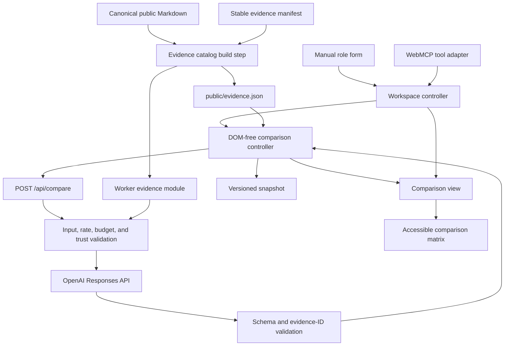
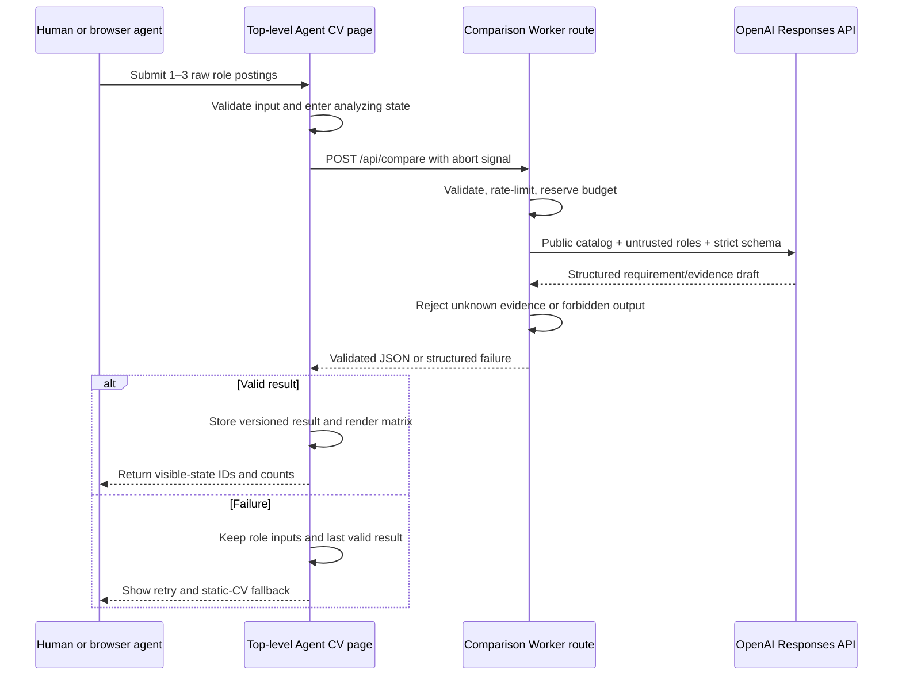
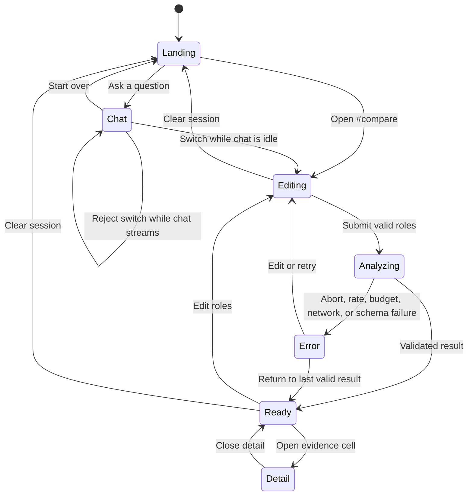

# Role Comparison with WebMCP - Plan

## Goal Capsule

- **Objective:** A recruiter or hiring broker can compare John against one to three open roles in one grounded, inspectable workspace, whether they enter the roles manually or through a supported browser agent.
- **Means:** Add a site-owned structured comparison engine, a public evidence catalog, a shared browser controller, and a thin WebMCP adapter on the existing top-level page. (KTD1–KTD6)
- **Authority:** The Product Contract owns user-visible behavior. The Planning Contract owns implementation mechanisms. Canonical public Markdown remains the authority for candidate facts.
- **Execution profile:** Implement as seven dependency-ordered units in the existing framework-free Cloudflare Worker and static-site architecture.
- **Stop conditions:** Stop if the comparison would require private CV material, durable role storage, candidate scoring, unsupported native WebMCP claims, or a projected monthly OpenAI spend of $100 or more.
- **Tail ownership:** The final unit owns live deployment verification and the OpenAI WebMCP Challenge submission package.

---

## Product Contract

### Summary

Extend Agent CV with a comparison workspace that accepts one to three role postings and renders them as columns against aligned requirement rows. Each cell shows approved evidence, a clearly labeled transferable inference, a documentation gap, or a neutral role-specific absence. Visitors can inspect sources and collect questions for John without receiving a fit score or hiring recommendation.

### Problem Frame

The existing site answers one question at a time and can ground a chat in one privately created role link. It does not help a recruiter compare several openings at once, and its text-streaming chat contract cannot safely produce a structured, inspectable matrix. The WebMCP challenge creates an opportunity to make that comparison a shared live-page workflow for humans and agents while preserving the site's evidence and privacy boundaries.

### Key Decisions

- **Build the candidate-owned Agent CV proof of concept first.** (session-settled: user-directed — chosen over a multi-profile talent marketplace: the existing personal site is the fastest credible competition entry.) Governs R1–R10 and R15.
- **Use progressive WebMCP on the existing site.** (session-settled: user-directed — chosen over a separate local or remote MCP server: the live page, public resources, and HTTP fallback already provide the needed surfaces.) Governs R6, R10, and R11.
- **Support human evaluation without making a hiring decision.** (session-settled: user-approved — chosen over fit scores and automatic ranking: the comparison should expose evidence and uncertainty for recruiter judgment.) Governs R3–R5 and R7.
- **Keep role comparison transient.** (session-settled: user-approved — chosen over saved comparisons and recruiter-to-John messaging: browser-session state preserves privacy and keeps the proof of concept focused.) Governs R9, R12, and R14.

### Actors

- A1. **Human visitor:** A recruiter, hiring manager, or broker who enters roles, reviews evidence, and decides what to investigate.
- A2. **WebMCP-capable browser agent:** ChatGPT Work or Codex operating on the same top-level page with user-approved site-tool calls.
- A3. **Non-WebMCP browser agent:** Grok, Hermes, OpenClaw, Claude, or another agent that uses the normal page, public resources, or HTTP API.
- A4. **Site owner/operator:** John, who curates public evidence, configures spend controls, and ships the competition entry.
- A5. **Hosted comparison model:** The OpenAI Responses API, which extracts role requirements and proposes evidence mappings under a strict output schema.

### Requirements

**Comparison workspace**

- R1. The top-level page must offer a comparison mode at `/#compare` without removing or replacing the existing landing, chat, CV, Markdown, contact, or application-link experiences.
- R2. The comparison must accept one to three roles in input order, with a required title and description, an optional company, per-field bounds, and a combined payload bound.
- R3. A successful comparison must render roles as columns and aligned requirement themes as rows, with the original role requirement wording available in each cell's detail when that role lists the requirement.
- R4. A `documented` or `transferable` result cell must expose its evidence, source link, contribution wording, project status when applicable, and controlled relevance reason. A `not_documented` or `not_listed` cell must expose its coverage state without fabricated evidence. Every cell may expose suggested questions for John.
- R5. Evidence coverage must use `documented`, `transferable`, `not_documented`, or `not_listed`; questions for John are a separate flag so they can accompany any evidence state. `not_documented` must never imply that John lacks the capability.
- R6. The manual form and WebMCP tools must operate on the same browser controller, request contract, validated result, and visible workspace.
- R7. The feature must not calculate or expose scores, percentages, rankings, best-role conclusions, hiring recommendations, protected-trait inferences, or generated candidate claims.

**Evidence and trust**

- R8. Candidate facts displayed as evidence must resolve from a content-digested catalog derived only from approved public CV, overview, and project sources; repository material may only support a primary curated evidence item.
- R9. The site must keep role inputs, model results, and comparison questions only in same-origin `sessionStorage` and memory, and must not write them to KV, the conversation archive, application records, canonical CV updates, or content-bearing telemetry. The UI must separately disclose OpenAI API processing, possible provider retention, and browser-agent account history.
- R10. Job postings and model output must be treated as untrusted data, rendered with text-safe DOM operations, kept separate from trusted instructions, and rejected when they reference unknown evidence or forbidden fields. The model may select only allowlisted question kinds; the server owns the neutral question text.

**Agent compatibility and resilience**

- R11. The top-level page must register a small imperative WebMCP tool set when `document.modelContext.registerTool` exists, while preserving normal form controls, public resources, and `POST /api/compare` for non-WebMCP clients.
- R12. WebMCP support claims must be limited to verified clients; Grok, Hermes, OpenClaw, Claude, and similar agents are fallback compatibility targets through accessible browser interaction or the documented HTTP/resources contract.
- R13. The hosted comparison path must use a separate rate limiter and monthly cap, bounded model input and output, and an operational spend configuration whose worst-case chat-plus-comparison cost remains below $100 per month.
- R14. Invalid input, busy state, cancellation, timeout, rate limit, budget exhaustion, storage failure, upstream failure, and invalid model output must preserve role inputs and the last valid comparison while offering retry and static-CV fallbacks. Explicit Clear comparison is the exception: it removes the inputs and last valid comparison as required by R9.

**Quality and submission**

- R15. The delivered feature must include a live public URL, public source and setup instructions, a dated description of the post–August 25 challenge work, an English demo script for a public video under three minutes with audio, and a submission checklist for the September 3 deadline.
- R16. The comparison must be keyboard operable, screen-reader understandable, usable at 200% zoom, and responsive for three columns without encoding state only through color.

### Key Flows

- F1. **Manual comparison**
  - **Trigger:** A1 selects Compare roles or opens `/#compare`.
  - **Steps:** The visitor enters one to three roles, submits them, waits for analysis, reviews the matrix, opens evidence details, edits or retries, and clears when finished.
  - **Outcome:** The current tab contains an inspectable comparison or a recoverable error state with the inputs intact.
  - **Covered by:** R1–R10, R13, R14, R16.
- F2. **WebMCP comparison**
  - **Trigger:** A2 visits the top-level page and invokes the role-comparison site tool with user approval.
  - **Steps:** The page validates raw roles, runs the same comparison path as F1, renders the result in place, returns compact verification metadata, and lets the agent focus a selected cell.
  - **Outcome:** Human and agent inspect and manipulate the same visible comparison without navigating away from the tool-owning page.
  - **Covered by:** R2–R12, R14, R16.
- F3. **Non-WebMCP fallback**
  - **Trigger:** A3 visits with no WebMCP API or reads `llms.txt` or `AGENTS.md`.
  - **Steps:** The agent operates the semantic form through browser automation or calls the documented public resources and `POST /api/compare` contract.
  - **Outcome:** The comparison outcome remains available without a native WebMCP compatibility claim.
  - **Covered by:** R1, R2, R6, R10–R14, R16.

### Acceptance Examples

- AE1. **Three-role WebMCP comparison**
  - **Covers:** R2–R8, R11.
  - **Given:** A2 is on `/` with WebMCP enabled and supplies three valid role postings.
  - **When:** The comparison tool completes.
  - **Then:** The page shows three role columns, no score or ordering recommendation, and every non-gap evidence claim resolves to a canonical public source.
- AE2. **Manual parity**
  - **Covers:** R1, R2, R6.
  - **Given:** WebMCP is absent.
  - **When:** A1 submits the same role fixtures through the form.
  - **Then:** The page reaches the same validated result shape and supports the same drill-down controls.
- AE3. **Role-count boundary**
  - **Covers:** R2, R13, R14.
  - **Given:** A form, tool, or API request contains zero or four roles.
  - **When:** It is submitted.
  - **Then:** It consumes an abuse-rate-limit attempt but no monthly model budget, returns the same field-level error, and leaves the last valid workspace unchanged.
- AE4. **Untrusted content containment**
  - **Covers:** R7, R8, R10.
  - **Given:** A role posting contains instructions, markup, URLs, a scoring request, or protected-trait criteria.
  - **When:** The comparison runs.
  - **Then:** The content renders inertly, no URL is fetched, forbidden output is rejected, and only allowlisted evidence can appear as a candidate fact.
- AE5. **Recoverable upstream failure**
  - **Covers:** R13, R14.
  - **Given:** A valid comparison already exists and a replacement request times out, is canceled, exceeds the rate limit, exhausts the budget, returns invalid JSON, or carries a catalog digest that does not match the browser catalog.
  - **When:** The request fails.
  - **Then:** The prior valid result and the new editable role inputs remain available with a retry and static-CV fallback.
- AE6. **Session lifecycle**
  - **Covers:** R9, R14.
  - **Given:** A ready comparison exists.
  - **When:** The same tab reloads, a new browser session opens, the evidence digest changes, or Clear comparison is selected.
  - **Then:** A matching same-tab session restores; a new session starts empty; a stale result restores only role inputs; Clear removes local comparison state.
- AE7. **Structural absence versus evidence gap**
  - **Covers:** R3–R5, R7.
  - **Given:** One aligned theme is absent from Role B but present in Role A with no supporting public evidence.
  - **When:** The matrix renders.
  - **Then:** Role B shows `not_listed`, Role A shows `not_documented`, and neither state is converted into a fit score.
- AE8. **Visible agent drill-down**
  - **Covers:** R4, R6, R11, R16.
  - **Given:** A ready matrix exists.
  - **When:** A2 invokes the focus tool with a valid role and row ID.
  - **Then:** The corresponding detail opens, focus moves to it, the page announces the change, and the tool returns the focused IDs without echoing the full posting.

### Success Criteria

- Human and WebMCP entry paths produce one shared, editable comparison workspace from fixed one-, two-, and three-role fixtures.
- Every displayed candidate fact is traceable to an approved public evidence ID; unknown IDs and forbidden fields fail closed.
- No comparison request or result is present in site-controlled KV, conversation archives, application records, canonical data, or content-bearing telemetry after verification with sentinel strings.
- The site remains fully usable with WebMCP absent, model service unavailable, or the monthly comparison cap exhausted.
- The live demo completes tool discovery, a three-role comparison, and one evidence drill-down within the competition video's three-minute limit.

### Scope Boundaries

**In scope now**

- A candidate-owned role comparison on the existing Agent CV.
- A public evidence catalog, transient comparison state, manual hosted generation, WebMCP tools, documented HTTP/resource fallbacks, and competition submission materials.

**Deferred to Follow-Up Work**

- Saved or shareable comparisons, recruiter accounts, recruiter-to-John question delivery, exports, contact handoffs, and profile updates from observed gaps.
- A multi-profile talent marketplace, AI-led profile interviews, broker search, native integrations for additional agent ecosystems, and any business model.
- A separate MCP server if later demand requires tools that work without an open page.

**Outside this product's identity**

- Automated fit scores, candidate rankings, hiring decisions, or protected-trait inference.
- Silent changes to canonical profile claims or autonomous messages sent on behalf of a visitor or John.
- Arbitrary URL, live repository, or private-source ingestion from a role posting.

---

## Planning Contract

### Key Technical Decisions

- KTD1. **Use a site-owned comparison engine.** `POST /api/compare` accepts raw role text and returns a strictly structured draft; visiting agents cannot supply candidate claims, mappings, or scores. This gives manual and agent users one grounding and privacy boundary. [Chrome WebMCP best practices](https://developer.chrome.com/docs/ai/webmcp/best-practices)
- KTD2. **Keep the comparison in the top-level home document.** A workspace controller owns hash routing, cross-mode transitions, focus restoration, and chat/comparison busy arbitration while comparison logic remains DOM-free. `public/app.js` composes the workspace, comparison, view, and WebMCP modules so adapters cannot bypass shared guards. This preserves page-scoped tools and implements R1 and R11. [OpenAI Site tools](https://learn.chatgpt.com/docs/webmcp)
- KTD3. **Generate a content-digested evidence catalog from canonical public content.** A stable-ID manifest contains only selectors, presentation labels, and allowlisted support links; all candidate prose, contribution wording, and status come from `data/cv.md`, `data/overview.md`, or `data/projects.md`. Synchronization emits bounded browser and Worker copies with one deterministic digest and fails on missing, ambiguous, private, unsafe-link, or repository-only primary selectors.
- KTD4. **Generate and validate one comparison contract.** A canonical JSON contract emits browser- and Worker-importable validators for limits, enums, required fields, and `additionalProperties` rules. The Responses API uses matching strict Structured Outputs with `store: false`, and server code independently validates the parsed result before returning JSON. `store: false` prevents Responses application-state storage but does not promise zero provider retention. [OpenAI Responses API](https://developers.openai.com/api/reference/resources/responses/methods/create), [OpenAI data controls](https://developers.openai.com/api/docs/guides/your-data)
- KTD5. **Separate persisted snapshots from runtime request state.** `ComparisonSnapshot` stores normalized roles, the last valid result, selected IDs, schema version, and catalog digest in `sessionStorage`. Status, errors, request generation, and `AbortController` remain in memory; a monotonic request token prevents late responses from reviving canceled, cleared, or superseded work.
- KTD6. **Expose four static imperative site tools.** Register `compare_candidate_roles`, `get_comparison_state`, `focus_comparison_cell`, and `clear_role_comparison` through `document.modelContext.registerTool` with narrow schemas, explicit annotations, handler validation, abort propagation, and concise JSON-serializable results. Do not use declarative tools or iframe registration. [OpenAI WebMCP limitations](https://learn.chatgpt.com/docs/webmcp#limitations)
- KTD7. **Isolate comparison cost and site-controlled retention from chat.** Use a dedicated comparison rate limiter and monthly request bucket, a configurable `COMPARISON_MODEL` defaulting to the cost-efficient existing backend model, fixed input/output bounds, no background or conversation IDs, no archive calls, and no role-content logging. Pair the app cap with an OpenAI project spend limit below $100 and document the project's actual data-control setting.
- KTD8. **Keep model-authored candidate claims and question prose out of the result contract.** The model may return bounded requirement excerpts, known evidence IDs, controlled relevance reason codes, coverage states, and allowlisted question kinds. Canonical evidence text, deterministic relevance labels, and neutral question wording come from site-owned code; questions never enter WebMCP getter output or `/api/ask` automatically.
- KTD9. **Fail closed at the public endpoint boundary.** Every bounded POST attempt hits the dedicated abuse limiter before JSON parsing; monthly budget is reserved only after full validation. Browser requests require the canonical origin and same-site fetch metadata, server agents may omit `Origin`, content type must be JSON, and missing production limiter or budget bindings make comparison unavailable.

### High-Level Technical Design

#### Component and data flow

#### Shared manual and agent request sequence

#### Browser workspace lifecycle

### Implementation Constraints and Assumptions

- Use the existing framework-free ES module, Cloudflare Worker, Node test, and CSP conventions. Do not add an application framework for this feature.
- The role bounds start at one to three items; title and company are at most 120 characters; description is 80–8,000 characters; combined descriptions are at most 20,000 characters. The engine extracts at most eight primary requirements per role and aligns at most eighteen rows.
- Preserve role input order. Never sort columns or rows by evidence strength.
- A comparison request may replace a prior result only after complete server and browser validation against a matching catalog digest. Partial model output never becomes a ready matrix.
- A stale session restores role inputs but does not automatically spend budget to regenerate results.
- Limit the evidence catalog to 48 items and 64 KiB of normalized emitted JSON so public grounding cannot silently inflate prompt cost.
- Module dependencies flow from `public/app.js` into workspace, comparison controller, view, and WebMCP adapters; lower layers never import the composition root or each other through the DOM.
- Backend use of `gpt-5.6-luna` is independent of the browser-agent model. Real ChatGPT/Codex WebMCP testing must use a currently supported site-tools model such as GPT-5.6 Sol or GPT-5.6 Terra. [Official OpenAI documentation](https://learn.chatgpt.com/docs/webmcp)
- The WebMCP draft is an unstable external contract. Keep it behind `public/webmcp.js` and pin adapter tests to the subset used. [WebMCP Draft Community Group Report](https://webmachinelearning.github.io/webmcp/)

### System-Wide Impact

- **Visitors:** Recruiters gain a faster evidence review flow, but job postings may contain confidential details. The UI and privacy page must explain transient upstream processing before submission.
- **Agent clients:** WebMCP-capable clients gain direct page actions. Other agents retain outcome parity through the normal interface and documented resources, not transport parity.
- **Content maintenance:** Changes to public evidence can invalidate saved browser results. Deterministic digests, revalidation, and fail-closed browser/Worker skew handling make this explicit.
- **Operations:** Comparison traffic adds a second cost and abuse profile. It needs separate caps, rate-limit observability without content logs, and a documented provider spend limit.
- **Existing chat:** `/api/ask` and its sanitized SSE/archive contract stay unchanged. Suggested comparison questions must not be silently forwarded into the archived chat path.
- **Security:** The Worker receives untrusted job postings and model JSON. The comparison path must not fetch posting URLs, load private data, or allow model text to become an approved candidate fact.

### Risks and Mitigations

| Risk | Impact | Mitigation |
|---|---|---|
| WebMCP draft changes before or after judging | Tool discovery or lifecycle breaks | Isolate registration in one adapter, use feature detection, abort-driven cleanup, contract tests, and a fully functional manual fallback. |
| Real evidence is mapped misleadingly | A recruiter may over-trust an inference | Render canonical evidence separately from model rationale, label mappings as AI-proposed, distinguish `transferable`, and expose questions. |
| Job posting prompt injection changes behavior | Claims, scores, or data leakage could appear | Delimit role text as untrusted, forbid URL fetching, use strict output schema, validate fields and evidence IDs, and render text safely. |
| Browser drive-by traffic drains Worker or model capacity | The public endpoint becomes an abuse target | Require canonical browser origin and JSON, rate-limit every attempt before parsing, reserve model budget only after validation, and fail closed on missing production bindings. |
| `store: false` is mistaken for zero retention | Visitors receive an inaccurate privacy promise | Describe site-controlled storage separately from OpenAI abuse-monitoring and client history, and verify the deployed project's actual data-control setting. |
| Combined chat and comparison cost exceeds the ceiling | The free site becomes expensive or unavailable | Bound tokens, isolate request caps, calculate worst-case cost before deploy, configure headroom below $100, and set a provider project limit. |
| Browser and site-tool state diverge | Agent reports a result the visitor cannot see | Route all actions through one controller and return only after the validated visible state updates. |
| Three-column matrix becomes unusable on small screens | Core comparison is inaccessible | Use a semantic table, sticky row headers, bounded horizontal scrolling, focus management, textual statuses, and 200% zoom checks. |
| Competition deadline leaves insufficient integration time | A working feature ships without valid submission materials | Make challenge verification and submission artifacts an explicit unit and test the real OpenAI client before polishing optional details. |

### Sources and Research

- `docs/ideation/2026-08-28-agent-cv-webmcp-challenge-ideation.html` records the product exploration that led to the confirmed comparison concept.
- `src/chat-core.js`, `src/worker.js`, `public/app.js`, `public/chat-state.js`, `scripts/sync-public-data.mjs`, and `scripts/check-static.mjs` establish the repository patterns used by KTD1–KTD9 and U1–U6.
- [Official OpenAI site-tools documentation](https://learn.chatgpt.com/docs/webmcp) defines current ChatGPT Work/Codex support, top-level imperative registration, page lifetime, security review, and fallback expectations.
- [WebMCP Draft Community Group Report](https://webmachinelearning.github.io/webmcp/) and [Chrome's WebMCP guidance](https://developer.chrome.com/docs/ai/webmcp) define the draft API, tool schemas, lifecycle, permissions, local testing, and security considerations.
- [OpenAI Responses API](https://developers.openai.com/api/reference/resources/responses/methods/create) and [OpenAI data controls](https://developers.openai.com/api/docs/guides/your-data) define structured JSON output, `store: false`, request bounds, usage data, and provider retention disclosures.
- [OpenAI WebMCP Challenge](https://openai.com/webmcp-challenge/) and [official challenge rules](https://webmcp.devpost.com/rules) define the deadline, eligibility, judging criteria, public repository, live URL, and demo-video requirements.

### Sequencing

U1 establishes the evidence authority. U2 builds the only model boundary against it. U3 defines durable-in-tab state and controller contracts. U4 makes those contracts visible and accessible. U5 adds WebMCP as an adapter to the working manual path. U6 locks discovery, privacy, and static parity. U7 verifies, deploys, and packages the competition entry.

---

## Implementation Units

### U1. Build the public evidence catalog

- **Goal:** Create a stable, versioned set of approved evidence objects that both the model and browser can reference without duplicating canonical CV prose.
- **Requirements:** R4, R7–R10.
- **Dependencies:** None.
- **Files:**
  - `config/comparison-evidence.json`
  - `scripts/build-comparison-evidence.mjs`
  - `scripts/sync-public-data.mjs`
  - `public/evidence.json`
  - `src/data/comparison-evidence.js`
  - `test/comparison-evidence.test.mjs`
  - `package.json`
- **Approach:**
  1. Define stable evidence IDs that select exact approved blocks by source path and stable heading or selector; keep candidate prose, contribution wording, and status out of the manifest.
  2. Generate public JSON and a Worker-importable module from the same manifest during `npm run sync:data`.
  3. Compute one deterministic digest over normalized emitted evidence and reject missing, ambiguous, private, unsafe-link, oversized, or repository-only primary evidence.
  4. Revalidate `/evidence.json` instead of allowing long-lived stale caching, and keep generated outputs synchronized without adding ignored private data to Git.
- **Patterns to follow:** `scripts/sync-public-data.mjs`, canonical `data/*.md` ownership, and the repository allowlist's fail-closed treatment of derived evidence.
- **Test scenarios:**
  - A valid manifest emits identical stable IDs and canonical text to both public and Worker outputs.
  - A missing heading, ambiguous selector, duplicate ID, private source, or repository-only primary item fails generation.
  - A repository support link is accepted only when attached to a primary item sourced from CV, overview, or projects.
  - Reordering unrelated Markdown does not change stable IDs; changing selected evidence changes the generated digest.
  - Traversal selectors, private strings, Markdown HTML, `javascript:` or `data:` links, more than 48 items, and output above 64 KiB fail generation.
- **Verification:** A reviewer can resolve every catalog item back to a public canonical source, and `npm run sync:data` detects drift.

### U2. Add the bounded structured comparison endpoint

- **Goal:** Produce one validated comparison result from raw roles and public evidence without changing the chat stream or archiving role content.
- **Requirements:** R2–R10, R13, R14.
- **Dependencies:** U1.
- **Files:**
  - `config/comparison-contract.json`
  - `scripts/build-comparison-contract.mjs`
  - `src/data/comparison-contract.js`
  - `public/comparison-contract.js`
  - `src/comparison-core.js`
  - `src/comparison-handler.js`
  - `src/worker.js`
  - `wrangler.jsonc`
  - `test/comparison-core.test.mjs`
  - `test/worker.test.mjs`
- **Approach:**
  1. Generate Worker and browser validators from one request/result contract with stable opaque IDs, bounded requirement text, coverage enums, evidence IDs, controlled reason codes, questions, and catalog digest.
  2. Add `OPTIONS` and `POST /api/compare`; accept canonical same-origin browser requests and documented server-agent calls with no `Origin`, but reject hostile browser origins, cross-site fetch metadata, and non-JSON content.
  3. Apply the dedicated abuse limiter before parsing every bounded POST, then reserve monthly model budget only after full validation; fail closed when required production bindings are absent.
  4. Call the Responses API with the public catalog, untrusted role delimiters, matching strict Structured Outputs, `store: false`, no background or conversation state, a configurable model, fixed output tokens, and composed client-abort/header-timeout cancellation.
  5. Reject the complete draft on unknown IDs, missing required evidence, forbidden fields, invalid states, excessive rows, or any score/ranking output.
  6. Return bounded JSON errors with `/cv/` fallback and do not call archive or application-storage helpers.
- **Execution note:** Start with failing request/response and privacy-boundary tests because this unit creates the trust and spend boundary for every client.
- **Patterns to follow:** `src/chat-core.js` input errors and untrusted transcript rules, `src/worker.js` CORS/rate/budget handling, and `test/worker.test.mjs` injected fetch fixtures.
- **Test scenarios:**
  - Covers AE3. Zero, four, oversized, malformed, and unexpected-field role payloads consume an abuse-rate-limit attempt but no monthly model budget.
  - Canonical preflight succeeds; hostile browser origins, cross-site fetch metadata, text/plain form posts, and spoofed browser requests fail; an absent `Origin` follows the documented server-agent path.
  - Concurrent valid requests reserve the monthly bucket atomically, and missing limiter or budget bindings fail closed under production fixtures.
  - A valid one-, two-, or three-role payload preserves role order and returns no more than eight requirements per role or eighteen aligned rows.
  - Covers AE4. Injection text, fake metrics or employers, markup, URLs, protected-trait requests, score fields, and ranking conclusions cannot become candidate evidence or tool output.
  - Unknown evidence IDs, `documented` or `transferable` without evidence, evidence on `not_documented` or `not_listed`, invalid enums, and extra fields reject the whole draft.
  - Client abort before headers, header timeout, and a late upstream response after abort cannot update the visible request generation; other provider failures return bounded public errors.
  - Sentinel role text appears in the transient upstream request fixture but not archive, application KV, telemetry payloads, or logs.
  - `/api/ask` still emits only the existing sanitized SSE event contract.
- **Verification:** The endpoint returns only schema-valid, public-evidence-grounded JSON and shares no persistence or stream behavior with `/api/ask`.

### U3. Implement the shared comparison session and controller

- **Goal:** Give manual controls and WebMCP one deterministic state machine with validated same-tab restoration and failure recovery.
- **Requirements:** R2, R5, R6, R9, R10, R14.
- **Dependencies:** U1, U2.
- **Files:**
  - `public/comparison-state.js`
  - `public/comparison-controller.js`
  - `public/workspace-controller.js`
  - `public/app.js`
  - `test/comparison-state.test.mjs`
  - `test/comparison-controller.test.mjs`
- **Approach:**
  1. Define a schema-versioned `ComparisonSnapshot` whitelist with bounded serialization, injected storage, normalized role inputs, last valid result, selected IDs, schema version, and catalog digest.
  2. Keep status, error, request generation, and abort controller in memory; invalidate the monotonic request token on cancel, clear, or replacement so late responses cannot win.
  3. Add a workspace controller for hash routing, focus restoration, cross-mode transitions, and chat/comparison busy arbitration; inject it into manual and WebMCP paths from `public/app.js`.
  4. Implement one `submitComparison` path that validates locally, passes an abort signal to `/api/compare`, awaits a matching revalidated catalog, updates visible state, and only then persists the snapshot.
  5. Restore matching snapshots, normalize interrupted work to editing or the last ready result, degrade storage errors to memory, and restore only role inputs when schema or catalog digests are stale.
- **Patterns to follow:** `public/chat-state.js` bounds and storage injection, `public/stream.js` cancellation discipline, and pure helper tests under `node:test`.
- **Test scenarios:**
  - Covers AE6. Matching same-tab state restores; stale or corrupted state retains only valid role inputs; Clear removes state; storage exceptions do not break the UI.
  - Duplicated-tab behavior is documented; prototype-keyed or oversized stored objects are rebuilt through the whitelist and never merged into runtime state.
  - A second submit while analyzing returns `busy` and does not start another fetch.
  - A successful result replaces the previous result only after browser-side schema and evidence validation.
  - Covers AE5. Abort, network error, public API error, or invalid response leaves the current inputs and prior valid result intact.
  - Clear during a request erases memory and storage, aborts the request, and rejects a late response with the superseded request token.
  - Browser/Worker catalog skew or catalog-load failure preserves inputs and the prior result but never displays the new draft.
  - Manual and injected agent calls with identical roles reach identical controller states and result IDs.
  - `not_listed` remains distinct from `not_documented`, and questions can coexist with every coverage state.
- **Verification:** State transitions are deterministic under fixtures, and all consumers can call the controller without direct DOM or storage mutation.

### U4. Build the accessible top-level comparison workspace

- **Goal:** Turn the existing home page into a clear landing/chat/comparison workspace while preserving its editorial, chat-first character.
- **Requirements:** R1–R7, R14, R16.
- **Dependencies:** U3.
- **Files:**
  - `public/index.html`
  - `public/app.js`
  - `public/comparison-view.js`
  - `public/styles.css`
  - `test/comparison-view-model.test.mjs`
- **Approach:**
  1. Add a restrained Compare roles entry point and a semantic one-to-three-role form at `/#compare`.
  2. Keep comparison rendering in its own module and use `public/app.js` only as the composition root for chat, workspace, comparison, and WebMCP dependencies.
  3. Render a captioned semantic table with role column headers, requirement row headers, textual state badges, keyboard-operated detail controls, source links, inference labels, and suggested questions.
  4. Use `aria-live`, focus movement, `aria-expanded`, `aria-controls`, a sticky requirement column, and bounded horizontal scrolling for narrow screens and zoom.
  5. Preserve idle chat state when switching views, reject switching while a chat request streams, and never forward suggested questions into `/api/ask` without a separate explicit user action and retention warning.
  6. Handle initial hash, hash changes, back/forward, invalid hashes, focus restoration, and `/#compare` precedence without navigating away from `/`.
- **Patterns to follow:** Native semantic elements and `details` patterns in `public/application/index.html`, text-safe construction in `public/dom.js`, and responsive breakpoints in `public/styles.css`.
- **Test scenarios:**
  - Covers AE2. With no WebMCP global, a two-role form submission renders the expected validated view model and supports edit, retry, detail, and clear actions.
  - Covers AE7. A row with an absent requirement and an evidence gap exposes distinct text labels and accessible descriptions.
  - Covers AE8. Opening a cell detail updates expansion state, moves focus, and announces the selected role and requirement.
  - Switching from idle chat preserves its transcript; attempting to switch during streaming keeps chat visible and explains the busy state.
  - Role descriptions and generated questions containing HTML render as text and never create active elements.
  - Initial `/#compare`, back/forward, invalid hashes, and direct tool-driven mode changes produce the expected visible mode and focus target.
  - One and three roles remain readable at mobile widths and 200% zoom with keyboard-only navigation and no color-only status.
- **Verification:** A browser user can complete F1 without WebMCP, and existing landing, chat, navigation, and application-link flows remain intact.

### U5. Register WebMCP as a thin page adapter

- **Goal:** Let supported agents create, inspect, focus, and clear the same visible comparison workspace used by humans.
- **Requirements:** R2, R4, R6, R10–R12, R14, R16.
- **Dependencies:** U3, U4.
- **Files:**
  - `public/webmcp.js`
  - `public/app.js`
  - `test/webmcp.test.mjs`
- **Approach:**
  1. Feature-detect `document.modelContext.registerTool`, register in the top-level module, and leave the page unchanged when registration is absent or rejected.
  2. Define four static non-overlapping tools from KTD6 with titles, exact visible effects, strict JSON Schemas using `additionalProperties: false`, and handler-side validation.
  3. Accept only raw role title, optional company, and raw description in the comparison tool; do not accept evidence prose, mappings, scores, recruiter identity, or arbitrary URLs.
  4. Pass the execution abort signal into the shared workspace/controller path and return a fixed allowlist of status, schema/catalog digest, opaque role/row IDs, counts, and visible region. Never return titles, companies, excerpts, rationales, questions, upstream errors, or stack messages.
  5. Use `readOnlyHint` only for the state getter. Mark comparison, focus, and clear as page-state mutations and drive registration cleanup with an AbortSignal.
- **Patterns to follow:** External ES modules under the current CSP, feature detection at browser boundaries, and controller injection for deterministic tests.
- **Test scenarios:**
  - The mocked model context captures exactly four valid tool definitions with expected names, annotations, and bounded schemas.
  - Covers AE1. A valid three-role tool invocation calls the shared controller once, renders before resolving, and returns matching role/row IDs without full posting text.
  - Covers AE3. Zero, four, unexpected-field, oversized, and candidate-claim inputs fail in the handler before controller or network work.
  - Covers AE8. A valid focus call opens the visible cell; unknown IDs return a structured error without changing focus.
  - Getter, focus, clear, validation, and upstream-error results match exact serialized field allowlists and contain no hostile role or model text.
  - Tool cancellation aborts the comparison request and preserves the previous result.
  - Missing API support, registration rejection, or disabled site tools produces no console failure and leaves F1 usable.
- **Verification:** Chrome's Model Context Tool Inspector and OpenAI's Available site tools list the same four actions, and invoked results match the visible workspace.

### U6. Publish discovery, privacy, and contract parity

- **Goal:** Make the feature correctly discoverable to agents and transparent to visitors without confusing browser site tools with MCP or HTTP endpoints.
- **Requirements:** R8–R13, R15.
- **Dependencies:** U1–U5.
- **Files:**
  - `public/llms.txt`
  - `public/AGENTS.md`
  - `public/privacy/index.html`
  - `public/_headers`
  - `README.md`
  - `scripts/check-static.mjs`
  - `src/worker.js`
  - `test/static-contract.test.mjs`
- **Approach:**
  1. Index `/#compare`, `/evidence.json`, and `POST /api/compare` in `llms.txt`; put complete schemas, limits, lifecycle, trust rules, examples, and fallbacks in public `AGENTS.md`.
  2. Document WebMCP tools as page-registered capabilities that exist only while `/` is open, and document ordinary UI/API/resource routes for Grok and other non-WebMCP agents.
  3. Explain same-origin `sessionStorage` lifecycle, tab duplication, site-controlled non-persistence, OpenAI processing and default abuse-monitoring retention, browser-agent account history, the deployed project's data-control setting, and why postings should not contain confidential material.
  4. Serve the evidence catalog with correct JSON type, CORS, revalidation caching, deterministic digest, and resource telemetry that records only path-level access.
  5. Extend static checks so route names, WebMCP tool names, input limits, evidence version references, observed resources, CSP, and docs remain in parity.
  6. Add a dated README section that distinguishes the challenge extension from the pre-existing Agent CV.
- **Patterns to follow:** `llms.txt` as index, `AGENTS.md` as detailed contract, `_headers` content rules, and existing API/static parity assertions in `scripts/check-static.mjs`.
- **Test scenarios:**
  - `llms.txt`, public `AGENTS.md`, source tool definitions, and Worker routes expose the same names and numeric limits.
  - `/evidence.json` has the expected content type, CORS, revalidation policy, catalog digest, and path-only telemetry behavior.
  - CSP preserves self-hosted-only scripts and `frame-ancestors 'none'`; the current WebMCP Permissions Policy permits only the top-level same-origin page.
  - Privacy copy accurately distinguishes session storage, site-controlled non-persistence, possible OpenAI abuse-monitoring retention, browser-agent history, 90-day chat retention, and persistent private application links.
  - README and deployed public docs describe Grok/browser automation as fallback compatibility, not native WebMCP support.
- **Verification:** Machine-readable and human-readable contracts agree, and no documentation calls site tools WebMCP endpoints.

### U7. Verify, deploy, and package the challenge entry

- **Goal:** Produce a reproducible live demonstration and complete submission package before the competition deadline.
- **Requirements:** R13, R15, R16.
- **Dependencies:** U1–U6.
- **Files:**
  - `test/fixtures/comparison-roles.json`
  - `docs/webmcp-challenge-submission.md`
  - `README.md`
- **Approach:**
  1. Add synthetic one-, two-, and three-role fixtures that contain no real recruiter or confidential data and can be reused across API, browser, and video verification.
  2. Record local Chrome-flag and Tool Inspector checks, real ChatGPT Work/Codex checks, non-WebMCP fallback checks, site-controlled privacy sentinels, accessibility checks, and live deployment evidence.
  3. Calculate the worst-case monthly chat-plus-comparison cost from configured input/output and request caps against current pricing, then set app caps and the OpenAI project spend limit with headroom below $100.
  4. Prepare an English public-repo/live-URL/setup checklist, a concise project description, and a sub-three-minute narrated demo script that shows tool discovery, three-role rendering, source drill-down, and no-score positioning.
  5. Deploy through the existing Cloudflare workflow and verify the canonical domain from OpenAI's built-in browser before submitting by 2026-09-03 22:00 Europe/Stockholm.
- **Execution note:** Prove the full competition flow in the real OpenAI browser before optional visual polish, because local Chrome support does not establish client availability.
- **Patterns to follow:** Existing `npm run build` and `npm run deploy` workflows, public MIT license, and repository deployment guidance.
- **Test scenarios:**
  - A fixed three-role fixture completes within the video budget and visibly demonstrates comparison plus one cell drill-down.
  - ChatGPT Work and Codex discover and invoke the intended tool for one and three roles; four-role input and explicit score, ranking, or recommendation fields fail validation, while scoring instructions embedded inside untrusted role text are contained and cannot affect the result contract.
  - Chrome with WebMCP testing disabled, and a regular browser with no API, complete the manual flow without console errors.
  - A non-WebMCP agent can locate the comparison contract and use the page or API fallback without a remote MCP server.
  - Keyboard-only, screen-reader, mobile viewport, reduced-motion, and 200% zoom passes cover the complete comparison journey.
  - Site logs, KV fixtures, archives, canonical data, and tool-result payloads contain no sentinel role text after the session is cleared; OpenAI and client retention are assessed against their disclosed controls rather than this site assertion.
- **Verification:** The production URL, public repository, instructions, demo video, description, license, and Devpost fields satisfy the published challenge rules before the deadline.

---

## Verification Contract

| Gate | Applies to | Required outcome |
|---|---|---|
| `npm run check` | U1–U7 | Data synchronization, syntax checks, Worker package validation, Node tests, and static parity all pass. |
| `npm run build` | U1–U7 | The no-bundle Worker package closes over the generated evidence module and every new static asset. |
| Comparison API fixtures | U2, U3 | One-, two-, and three-role requests succeed; invalid, malicious, budget, timeout, abort, and model-output cases fail closed. |
| Progressive browser QA | U4–U6 | Landing, chat, manual compare, CV, application links, privacy, and resource fallbacks work with WebMCP absent. |
| Chrome WebMCP QA | U5–U7 | The testing flag and Tool Inspector expose correct schemas, annotations, tool selection, cancellation, and visible state. |
| OpenAI client QA | U5–U7 | ChatGPT Work and Codex on a supported site-tools model discover tools, render a three-role matrix, focus a cell, and record calls in Recently used/Sources. |
| Privacy sentinel audit | U2–U7 | Role text is absent from site logs, KV, archives, canonical data, and WebMCP results; `store: false`, no background/conversation state, and the deployed OpenAI data-control setting are documented. |
| Accessibility audit | U4, U5, U7 | Keyboard, focus, labels, announcements, semantic table structure, contrast, reduced motion, mobile layout, and 200% zoom meet R16. |
| Spend review | U2, U7 | Conservative worst-case monthly cost is documented below $100 and enforced by application caps plus a provider project limit. |
| Production smoke check | U6, U7 | Canonical HTTPS, headers, public resources, comparison API, manual flow, and real-client WebMCP flow work after deployment. |

---

## Definition of Done

- U1 is done when every comparison fact resolves to a stable public evidence ID and synchronization fails on drift or private evidence.
- U2 is done when `/api/compare` returns only fully validated structured JSON, shares no archive path with chat, and fails safely under abuse, budget, cancellation, and provider errors.
- U3 is done when manual and tool callers share one deterministic controller and same-origin session state survives only under the agreed schema version and catalog digest.
- U4 is done when a human completes the full one-to-three-role comparison and drill-down journey without WebMCP on desktop, mobile, keyboard, and zoomed layouts.
- U5 is done when the four site tools are discoverable in supported clients, invoke the shared controller, and leave the normal page intact when unsupported.
- U6 is done when public discovery, API, evidence, privacy, CSP, telemetry, and README contracts agree and automated parity checks prevent drift.
- U7 is done when the site is live, the cost ceiling is enforced, the public repo and setup are reproducible, and the challenge video and submission checklist are complete before the deadline.
- The overall work is done only when no fit score, unsupported claim, private evidence, persisted role text, abandoned experiment, dead code, or temporary debug artifact remains in the implementation diff.
